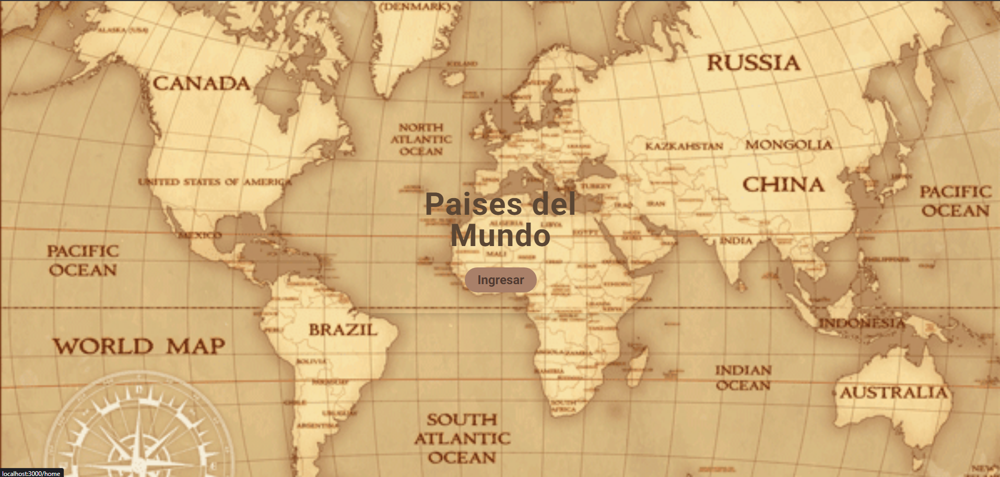
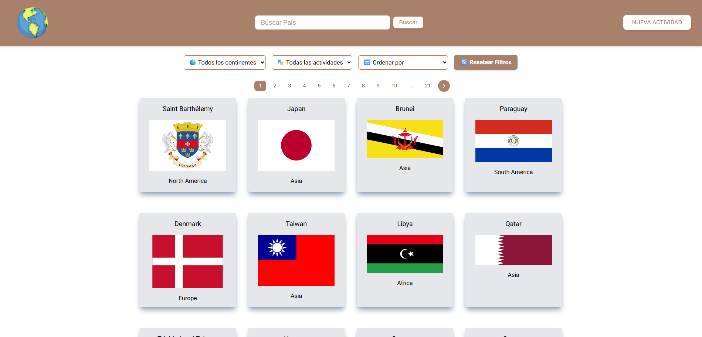
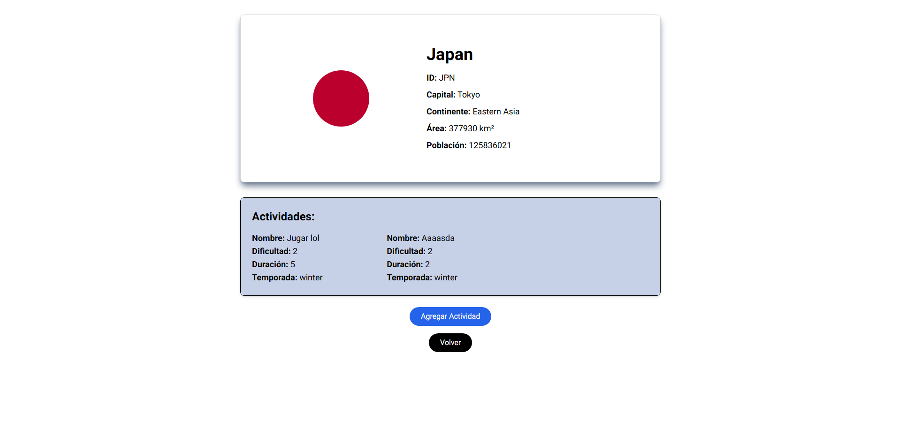

# 🌍 Countries App

Una aplicación web moderna para explorar países del mundo, crear actividades turísticas y gestionar información geográfica de manera interactiva.


## 📋 Tabla de Contenidos

- [Características](#-características)
- [Tecnologías Utilizadas](#-tecnologías-utilizadas)
- [Instalación](#-instalación)
- [Uso](#-uso)
- [API Endpoints](#-api-endpoints)
- [Capturas de Pantalla](#-capturas-de-pantalla)
- [Licencia](#-licencia)

## ✨ Características

- **🗺️ Exploración de Países**: Navega por más de 250 países con información detallada
- **🔍 Búsqueda Inteligente**: Busca países por nombre con filtrado en tiempo real
- **🎯 Filtros Avanzados**: Filtra por continente, actividades y ordena por población o nombre
- **🎭 Gestión de Actividades**: Crea y gestiona actividades turísticas para cada país
- **📱 Diseño Responsivo**: Optimizado para dispositivos móviles y desktop
- **⚡ Rendimiento**: Carga rápida con paginación eficiente
- **🎨 UI Moderna**: Interfaz intuitiva con Tailwind CSS

## 🛠️ Tecnologías Utilizadas

### Frontend
- **Next.js 14.0.4** - Framework React con SSR/SSG
- **React 18** - Biblioteca de interfaz de usuario
- **TypeScript 5** - Tipado estático para JavaScript
- **Tailwind CSS 3.3.0** - Framework de CSS utilitario
- **React Icons 5.0.1** - Iconografía moderna
- **React Toastify 11.0.3** - Notificaciones elegantes

### Backend
- **Express.js 4.18.2** - Framework web para Node.js
- **MongoDB 6.4.0** - Base de datos NoSQL
- **Mongoose 8.1.0** - ODM para MongoDB
- **CORS 2.8.5** - Configuración de CORS
- **Axios 1.6.7** - Cliente HTTP

### Gestión de Estado
- **Zustand 4.5.1** - Librería de estado global ligera

### Herramientas de Desarrollo
- **ESLint** - Linter para JavaScript/TypeScript
- **Prettier** - Formateador de código
- **Nodemon 3.0.3** - Auto-reload del servidor
- **Concurrently 8.2.2** - Ejecución concurrente de scripts

## 🚀 Instalación

### Prerrequisitos
- Node.js (versión 16 o superior)
- MongoDB (local o MongoDB Atlas)
- npm o yarn

### Pasos de Instalación

1. **Clona el repositorio**
   ```bash
   git clone https://github.com/tu-usuario/countries-app.git
   cd countries-app
   ```

2. **Instala las dependencias**
   ```bash
   npm install
   # o
   yarn install
   ```

3. **Configura las variables de entorno**
   ```bash
   cp .env.example .env.local
   ```
   
   Edita `.env.local` con tu configuración:
   ```env
   MONGODB_URI=mongodb://localhost:27017/countries-app
   PORT=3001
   NEXT_PUBLIC_API_URL=http://localhost:3001
   ```

4. **Inicia MongoDB**
   ```bash
   # Si usas MongoDB local
   mongod
   
   # O configura tu conexión a MongoDB Atlas
   ```

5. **Ejecuta la aplicación**
   ```bash
   npm start
   # o
   yarn start
   ```

La aplicación estará disponible en:
- **Frontend**: http://localhost:3000
- **Backend API**: http://localhost:3001

## 📖 Uso

### Funcionalidades Principales

1. **Explorar Países**
   - Navega por la lista paginada de países
   - Visualiza banderas, nombres y continentes
   - Haz clic en cualquier país para ver detalles

2. **Buscar Países**
   - Usa la barra de búsqueda en el navbar
   - Filtra por nombre del país
   - Resultados en tiempo real

3. **Filtrar y Ordenar**
   - Filtra por continente (Asia, Europa, África, etc.)
   - Ordena por nombre (A-Z, Z-A)
   - Ordena por población (ascendente/descendente)
   - Filtra países con/sin actividades

4. **Gestionar Actividades**
   - Ve detalles de un país
   - Crea nuevas actividades turísticas
   - Especifica dificultad, duración y temporada
   - Visualiza todas las actividades del país

## 🔗 API Endpoints

### Países
- `GET /api/countries` - Obtener todos los países
- `GET /api/countries/:id` - Obtener país por ID
- `GET /api/countries/search/:name` - Buscar países por nombre
- `GET /api/countries/filter/continent/:continent` - Filtrar por continente

### Actividades
- `GET /api/activities` - Obtener todas las actividades
- `POST /api/activities` - Crear nueva actividad
- `GET /api/activities/country/:countryId` - Actividades de un país

## 📱 Capturas de Pantalla

### Landing Page


### Lista de Países


### Detalles del País


## 📄 Licencia

Este proyecto está bajo la Licencia MIT. Ver el archivo `LICENSE` para más detalles.

## 👨‍💻 Autor

**Tu Nombre**
- GitHub: [@joaquinjachow](https://github.com/joaquinjachow)
- LinkedIn: [Joaquin Jachow](https://www.linkedin.com/in/joaquin-jachow/)
- Email: joacojachow@hotmail.com

## 🙏 Agradecimientos

- [REST Countries API](https://restcountries.com/) - Datos de países
- [React Icons](https://react-icons.github.io/react-icons/) - Iconografía
- [Tailwind CSS](https://tailwindcss.com/) - Framework CSS
- [Next.js](https://nextjs.org/) - Framework React

---

⭐ Si te gusta este proyecto, ¡dale una estrella en GitHub!